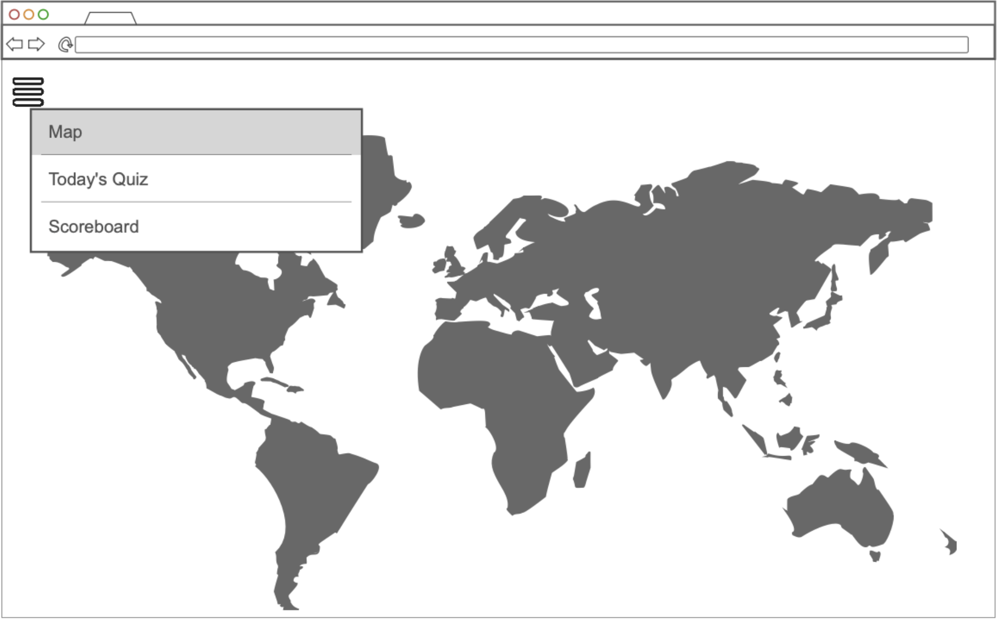
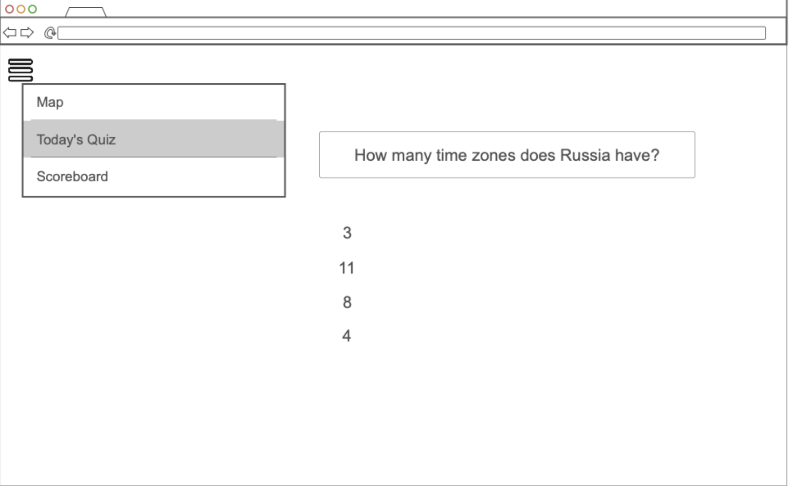
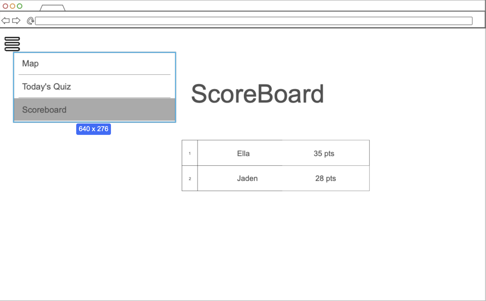

# CultureConnect 🌍

## 🚀 Specification Deliverable

### Elevator pitch

CultureConnect is an interactive platform that helps users learn and test their cultural knowledge. Imagine Dulingo, but for culture: instead of just langauges, users learn the different greetings, values, traditions, taboos, and key historical facts. Information is gathered from trusted online sites, with user ability to suggest edits that would be reviewed by team before updating. Users can quiz themselves after learning about any country and then compare their scores with that of other users.

### Design

 
 

 
 

 
 
 

### Key features

- Interactive World Map: Click on a country to learn about it
- Dynamic data: pull real cultulral information through third party APIs
- Authorization: User can register and login to save progress.
- Scoreboard: comparing score with other users through real time updates using websocket.

### Technologies

I am going to use the required technologies in the following ways.

- **HTML** - Structured layout for the site: map page, register/login, quizzez page, scoreboard
- **CSS** - responsive design to work on laptops and phones, matching colors, consistent branding
- **React** - Provides login, interactive map, answer choosing, comparing and showing others scores
- **Service** - Backend endpoints include: register/ login/ fetch data for country/ save quiz score/ pulling scores
- **DB/Login** - store users, quiz scores, user ranks, cultural data
- **WebSocket** - real time scoreboard updates

## 🚀 AWS deliverable

For this deliverable I did the following. I checked the box `[x]` and added a description for things I completed.

- [x] **Server deployed and accessible with custom domain name** - [My server link](https://yourdomainnamehere.click).

## 🚀 HTML deliverable

For this deliverable I did the following. I checked the box `[x]` and added a description for things I completed.

- [x] **HTML pages** 
- [x] **Proper HTML element usage**
- [x] **Links**
- [x] **Text**
- [x] **3rd party API placeholder** 
- [x] **Images**
- [x] **Login placeholder**
- [x] **DB data placeholder**
- [x] **WebSocket placeholder** 

## 🚀 CSS deliverable

For this deliverable I did the following. I checked the box `[x]` and added a description for things I completed.

- [x] **Header, footer, and main content body** 
- [x] **Navigation elements** 
- [x] **Responsive to window resizing**
- [x] **Application elements**
- [x] **Application text content**
- [x] **Application images**

- Created a "styles.css" and linked it to all HTML pages
- Styled the **header, footer, and navigation** with a gradient background and responsive layout.  
- Styled **main sections** (APIs, Database Data, WebSocket data, etc.) with card backgrounds and shadows.  
- Added **table styling** so database placeholder looks clean.  
- Styled **forms and buttons** with consistent padding and colors.  
- Ensured **images** resize properly and have rounded corners.  
- Added a **responsive design rule**: when the screen is smaller than 768px, the navigation and header stack vertically.  

## 🚀 React part 1: Routing deliverable

For this deliverable I did the following. I checked the box `[x]` and added a description for things I completed.

- [x] **Bundled using Vite** - I did not complete this part of the deliverable.
- [x] **Components** - I did not complete this part of the deliverable.
- [x] **Router** - I did not complete this part of the deliverable.

## 🚀 React part 2: Reactivity deliverable

For this deliverable I did the following. I checked the box `[x]` and added a description for things I completed.

- [ ] **All functionality implemented or mocked out** - I did not complete this part of the deliverable.
- [ ] **Hooks** - I did not complete this part of the deliverable.

## 🚀 Service deliverable

For this deliverable I did the following. I checked the box `[x]` and added a description for things I completed.

- [ ] **Node.js/Express HTTP service** - I did not complete this part of the deliverable.
- [ ] **Static middleware for frontend** - I did not complete this part of the deliverable.
- [ ] **Calls to third party endpoints** - I did not complete this part of the deliverable.
- [ ] **Backend service endpoints** - I did not complete this part of the deliverable.
- [ ] **Frontend calls service endpoints** - I did not complete this part of the deliverable.
- [ ] **Supports registration, login, logout, and restricted endpoint** - I did not complete this part of the deliverable.

## 🚀 DB deliverable

For this deliverable I did the following. I checked the box `[x]` and added a description for things I completed.

- [ ] **Stores data in MongoDB** - I did not complete this part of the deliverable.
- [ ] **Stores credentials in MongoDB** - I did not complete this part of the deliverable.

## 🚀 WebSocket deliverable

For this deliverable I did the following. I checked the box `[x]` and added a description for things I completed.

- [ ] **Backend listens for WebSocket connection** - I did not complete this part of the deliverable.
- [ ] **Frontend makes WebSocket connection** - I did not complete this part of the deliverable.
- [ ] **Data sent over WebSocket connection** - I did not complete this part of the deliverable.
- [ ] **WebSocket data displayed** - I did not complete this part of the deliverable.
- [ ] **Application is fully functional** - I did not complete this part of the deliverable.
